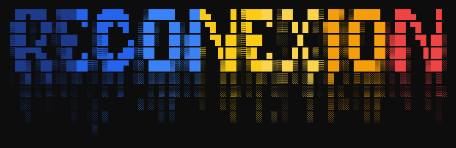
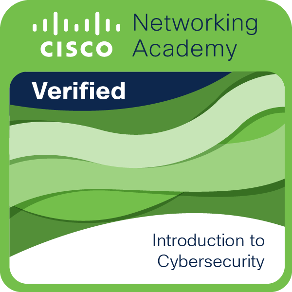
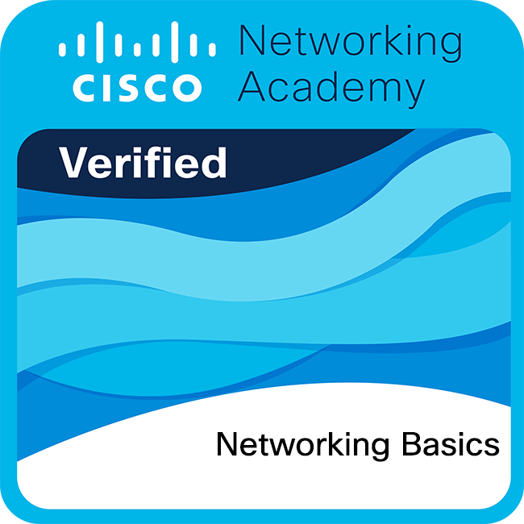
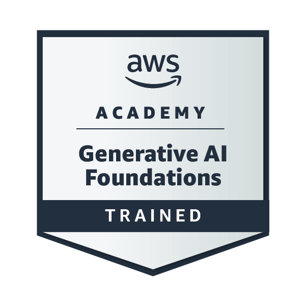

<div align="center">

<br>



<br><br>


<br>


</div>

<br>

<div align="center">

### `~ whoami`

</div>


```yaml
nombre:       Gael
rol:          Estudiante de Ingeniería en Software
enfoque:      Cybersecurity (pasión) · Mobile · Backend · Frontend
web:          React
ml:           En desarrollo
ubicacion:    México
now_playing:  The Strokes ▶ rock & code
```


<br>

<div align="center">


### `~ stack`

<br>


</div>

<br>

<div align="center">


### `~ proyectos`

</div>

<div align="center">

> [!TIP]
> **Tinta** — App de club de lectura con IA on-device (RAG). Módulo de recomendaciones ML con TF-IDF + K-Means.

> [!TIP]
> **NEXUS** — Hub de aprendizaje gamificado con mundos temáticos: CyberLab, Flutter, Robótica, IoT, Roblox y más.

> [!TIP]
> **VitalVest** — Chaleco IoT con monitoreo en tiempo real vía WebSocket + REST.

> [!TIP]
> **Pocket** — Toolbox de cybersecurity en Flutter, inspirado en Flipper Zero.

</div>

<br>

<div align="center">


### `~ certificaciones`

<br>

<table>
<tr>
<td align="center" width="220">
<br>
<b>Introduction to Cybersecurity</b><br>
<sub>Cisco Networking Academy</sub>
</td>
<td align="center" width="220">
<br>
<b>Networking Basics</b><br>
<sub>Cisco Networking Academy</sub>
</td>
<td align="center" width="220">
<a href="https://www.credly.com/badges/8339d815-3130-4c67-b514-9d83ea4407a7">

</a><br>
<b>Generative AI Foundations</b><br>
<sub>AWS Academy Graduate</sub>
</td>
</tr>
</table>

</div>

<br>

<div align="center">


### `~ en camino`

</div>

<div align="center">

```diff
+ Profundizando en cybersecurity ofensiva
+ Reverse engineering / game hacking
+ Machine Learning aplicado
+ Sistemas de aprendizaje autodirigido
```

</div>

<br>

<div align="center">


<details>
<summary><b>🎸 más sobre mí</b></summary>
<br>


</details>

<br>


</div>
